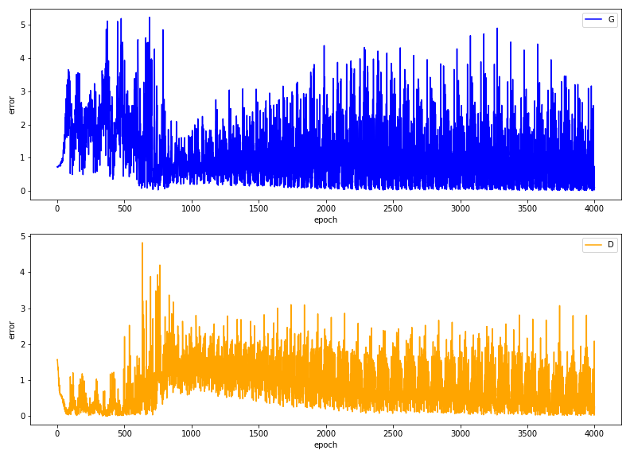
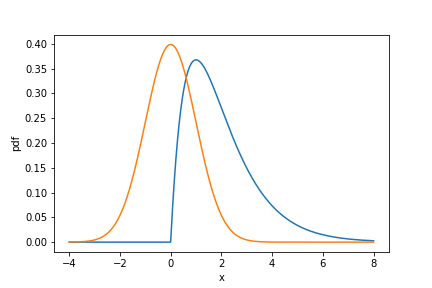

[](http://quantlet.de/)

## [](http://quantlet.de/) **GAN_Gamma_Distribution** [](http://quantlet.de/)

```yaml

Name of Quantlet: 'GAN_Gamma_Distribution'

Published in: ''

Description: 'Training a GAN on dataset of 1000 samples of a Gamma distribution. Input of the generator is a std. normal distribution, the GAN is trained for 4000 epochs. Every 100 epochs histograms of generated and training data are plotted.'

Keywords: 'GAN, distribution, transformation, simulation, generation, neural network'

Author: 'marius sterling'

```





### PYTHON Code
```python

import sys
import torch
from torch import nn, optim
from torch.autograd.variable import Variable
from torch import manual_seed as tset_seed
from torchvision import transforms, datasets
import torch.distributions as tdist
import matplotlib.pyplot as plt
import pandas as pd
import numpy as np
from tqdm import tqdm

np.set_printoptions(precision=4)
sample_size = 1000
tset_seed(42)

class DiscriminatorNet(torch.nn.Module):
	"""
	A three hidden-layer discriminative neural network
	"""
	def __init__(self):
		super(DiscriminatorNet, self).__init__()#has the same properties as the torch.nn.module
		n_features = sample_size
		n_out = 1
		layer_neurons=30
		self.hidden0 = nn.Sequential(#Modules will be added to it in the order they are passed in the constructor
		nn.Linear(n_features, layer_neurons),
		nn.LeakyReLU(0.2),
		nn.Dropout(0.1)
		)
		self.hidden1 = nn.Sequential(
		nn.Linear(layer_neurons, layer_neurons),
		nn.LeakyReLU(0.2),
		nn.Dropout(0.1)
		)
		self.hidden2 = nn.Sequential(
		nn.Linear(layer_neurons, layer_neurons),
		nn.LeakyReLU(0.2),
		nn.Dropout(0.1)
		)
		self.out = nn.Sequential(
		torch.nn.Linear(layer_neurons, n_out),
		torch.nn.Sigmoid()
		)
		self.requires_grad=True
		self.bias = tdist.Normal(0,0.1)

	def forward(self, x):
		x = self.hidden0(x)
		x = self.hidden1(x)
		x = self.hidden2(x)
		x = self.out(x)
		return x


class GeneratorNet(torch.nn.Module):
	"""
	A three hidden-layer generative neural network
	"""
	def __init__(self):
		super(GeneratorNet, self).__init__()
		n_features = 100
		n_out = sample_size
		layer_neurons=30
		self.hidden0 = nn.Sequential(
		nn.Linear(n_features, layer_neurons),
		nn.LeakyReLU(0.1)
		)
		self.hidden1 = nn.Sequential(	
		nn.Linear(layer_neurons, layer_neurons),
		nn.LeakyReLU(0.1)
		)
		self.hidden2 = nn.Sequential(
		nn.Linear(layer_neurons, layer_neurons),
		nn.LeakyReLU(0.1)
		)
		
		self.out = nn.Sequential(
		nn.Linear(layer_neurons, n_out),
		nn.Tanh()
		)
		# is used when net is setup 
	def forward(self, x):
		x = self.hidden0(x)
		x = self.hidden1(x)
		x = self.hidden2(x)
		x = self.out(x)
		return x


# Noise
def noise(size):
	n = Variable(tdist.Normal(0,1).sample((1,size)))

	return n
def ones_target(size):
    '''
    Tensor containing ones, with shape = size
    '''
    data = Variable(torch.ones(size))
    return data
def zeros_target(size):
    '''
    Tensor containing zeros, with shape = size
    '''
    data = Variable(torch.zeros(1,size))
    return data
def real_data_target(size):
	'''
	Tensor containing ones, with shape = size
	'''
	data = Variable(torch.ones(size, 1))
	return(data)
def fake_data_target(size):
	'''
	Tensor containing zeros, with shape = size
	'''
	data = Variable(torch.zeros(size, 1))
	return(data)

def pretrain_discriminator(optimizer,real_data):
	optimizer.zero_grad()
	prediction_real = discriminator(real_data)
	error_real = loss(prediction_real, ones_target(1))
	
	error_real.backward()

	#print(error_real.grad)
	
	optimizer.step()
	return(error_real)

def train_discriminator(optimizer, real_data, fake_data):
    N = real_data.size(0)

    # Reset gradients
    optimizer.zero_grad()
    # 1.1 Train on Real Data
    prediction_real = discriminator(real_data)
    
    # Calculate error and backpropagate
    
    error_real = loss(prediction_real, ones_target(1))
    error_real.backward()
    grad = [p.grad for p in list(discriminator.parameters())]
    
    # 1.2 Train on Fake Data
    prediction_fake = discriminator(fake_data)
    # Calculate error and backpropagate
    error_fake = loss(prediction_fake, zeros_target(1))
    error_fake.backward()
    
    # 1.3 Update weights with gradients
    optimizer.step()
    
    # Return error and predictions for real and fake inputs
    return error_real + error_fake, prediction_real, prediction_fake

def train_generator(optimizer, fake_data):
	# 2. Train Generator
	# Reset gradients
	optimizer.zero_grad()
	# Sample noise and generate fake data
	prediction = discriminator(fake_data)
	# Calculate error and backpropagate
	error = loss(prediction, real_data_target(prediction.size(0)))
	error.backward()
	# Update weights with gradients
	optimizer.step()
	# Return error
	return error

discriminator = DiscriminatorNet()
generator = GeneratorNet()
# Optimizers
d_optimizer = optim.Adam(discriminator.parameters(), lr=0.0002)
g_optimizer = optim.Adam(generator.parameters(), lr=0.0002)

def lr_decay(epoch):
	if epoch <= 2000:
		return 0.0004
	if epoch <= 4000:
		return 0.0002

# Loss function
loss = nn.BCELoss()

# Number of steps to apply to the discriminator
d_steps = 1  # In Goodfellow et. al 2014 this variable is assigned to 1
# Number of epochs
num_epochs = 4001
pretrain_d = 500

d_errors=[]
g_errors=[]

p=2
q=1
population = tdist.Gamma(p,q)
def population_sample(n):
	tset_seed(42)
	return population.sample(n)
print('Pretrain Discriminator')
for pre in range(pretrain_d):
	real_data = population_sample((sample_size,))
	pretrain_discriminator(d_optimizer,real_data)
	
pic=0
for epoch in range(num_epochs):
	
	real_data = np.array(population.sample((sample_size,)).data.tolist())
	
	real_data = torch.tensor(2*(real_data-real_data.min())/(real_data.max()-real_data.min())-1).type(torch.FloatTensor)
	
	# 1. Train Discriminator	  
	# Generate fake data
	fake_data = generator(noise(100)).detach()#detach means do not compute gradients
	# Train D
	d_error, d_pred_real, d_pred_fake = train_discriminator(d_optimizer,real_data, fake_data)

	# 2. Train Generator
	# Generate fake data
	fake_data = generator(noise(100))
	# Train G
	g_error = train_generator(g_optimizer, fake_data)
	
	#
	d_errors.append(d_error.item())
	g_errors.append(g_error.item())

	if epoch%100 == 0:
		print('Epoch: {:5d} , D-Loss: {:.4f}, G-Loss: {:.4f}'.format(epoch, np.round(d_error.data,2), np.round(g_error.data,2)))
		res_fake=generator(noise(100)).detach().data.tolist()
		res_real=population_sample((sample_size,)).data.tolist()

		res_fake=np.array(res_fake).flatten()
		res_real=np.array(res_real).flatten()

		res_real=2*(res_real-res_real.min())/(res_real.max()-res_real.min())-1
		res_fake=2*(res_fake-res_fake.min())/(res_fake.max()-res_fake.min())-1
		plt.hist(res_real,bins=31,edgecolor='black',density=True,alpha=.2)
		plt.hist(res_fake,bins=31,edgecolor='black',density=True,alpha=.2)
		plt.ylim(0,4)
		plt.title('GAN Gamma({},{}) Approximation: Epoch: {:4d}'.format(p,q,epoch))
		plt.savefig('GAN_Gamma_Hist_{}_{}_{}.png'.format(p,q,pic))
		plt.close()
		pic+=1
	g_optimizer.param_groups[0]["lr"] = lr_decay(epoch)
	d_optimizer.param_groups[0]["lr"] = lr_decay(epoch)
g_errors = pd.Series(g_errors)
g_errors.rolling(10)
d_errors = pd.Series(d_errors)
d_errors.rolling(10)

fig, ax = plt.subplots(2,figsize=(11,8))
ax[0].plot(g_errors,color='blue')
ax[0].legend('G_Error')
ax[0].set_xlabel('epoch')
ax[0].set_ylabel('error')

ax[1].plot(d_errors,color='orange')
ax[1].legend('D_Error')
ax[1].set_xlabel('epoch')
ax[1].set_ylabel('error')

#fig.suptitle('Generator and Discriminator Error',fontsize=12)
plt.tight_layout()
plt.savefig('GD_Error.png')

plt.show()


```

automatically created on 2020-11-25