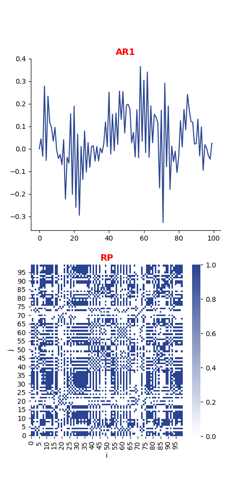
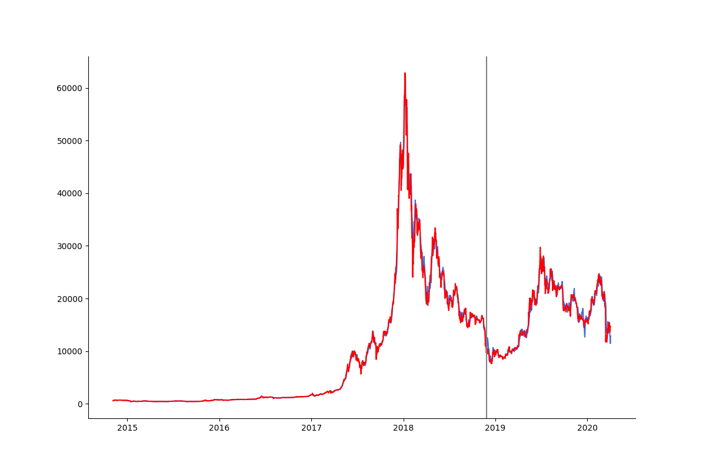
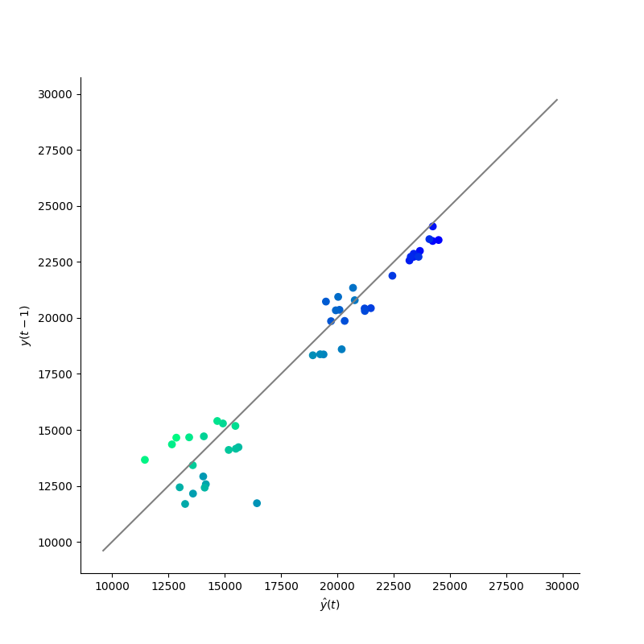
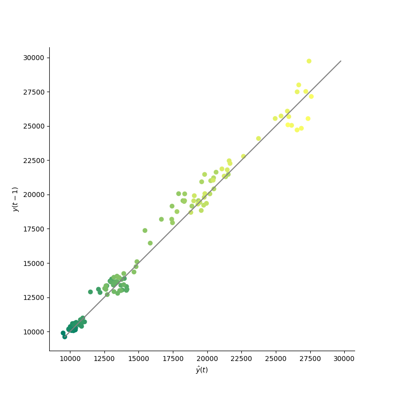
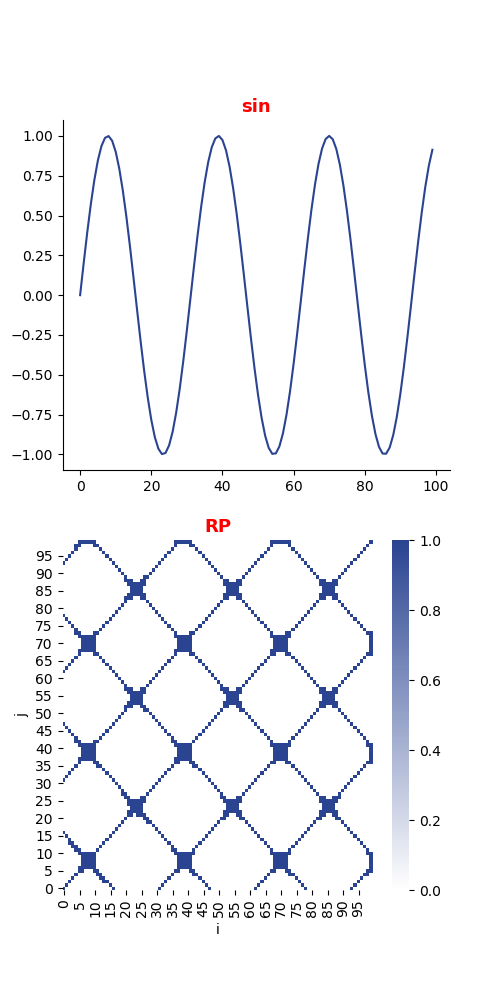
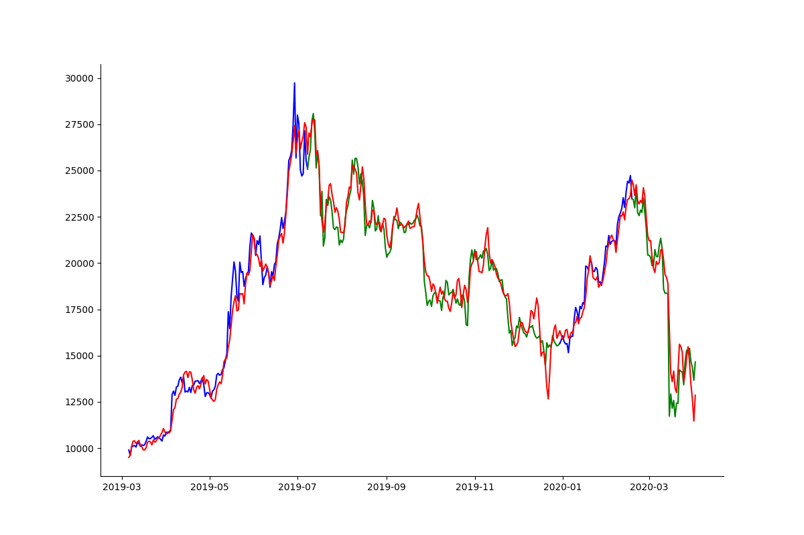
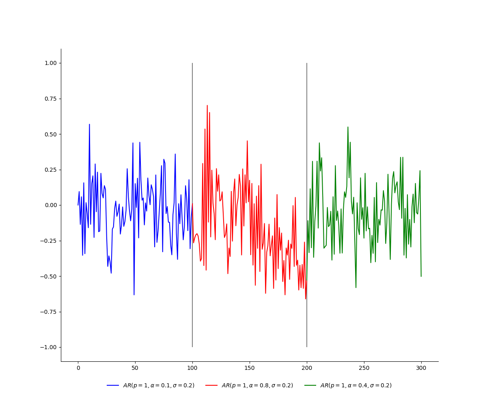
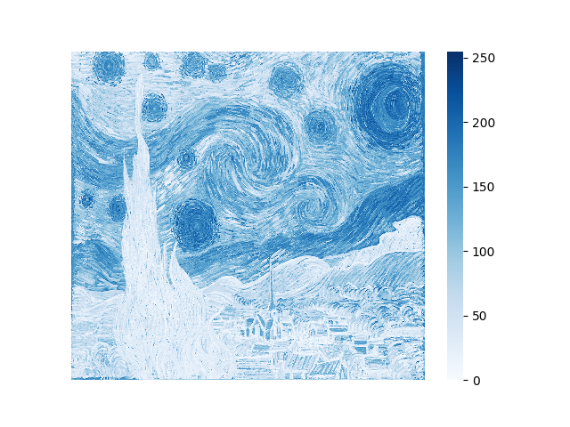

[](http://quantlet.de/)

## [](http://quantlet.de/) **GAN_TS_recurrence.py** [](http://quantlet.de/)

```yaml

Name of Quantlet: 'GAN_TS_recurrence.py'

Published in: ''

Description: 'Time series simulation and analysis with GAN. Visualisation with recurrence plots.'

Keywords: 'GAN, recurrence plot, time series, non stationarity, simulation'

Author: ''

```





















